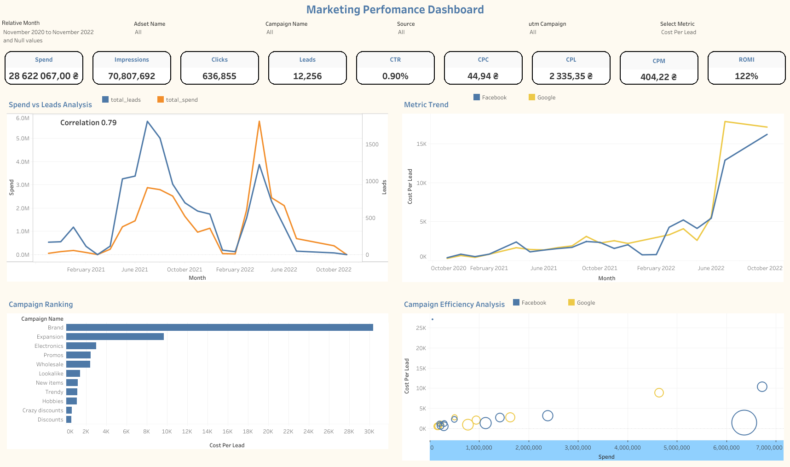

# 📊 Marketing Performance Dashboard

End-to-end marketing analytics project combining **Facebook Ads** and **Google Ads** data using **PostgreSQL / SQL** and visualizing campaign performance in **Tableau Public**.



## 🎯 Project Goal

The goal of the project is to give a marketing team a single interactive dashboard for monitoring advertising efficiency across channels, campaigns and audience segments.

The analysis focuses on spend, reach, clicks, leads, conversion efficiency and return on marketing investment.

## 🛠 Tech Stack

- **PostgreSQL / SQL** — data preparation and metric calculation
- **Tableau Public** — interactive dashboard and visualization
- **Facebook Ads + Google Ads** — advertising data sources
- **UTM parameters** — campaign attribution and filtering

## 🔄 Data Preparation Workflow

```text
Facebook Ads + campaign/adset dictionaries
                 ↓
            JOIN mappings
                 ↓
Google Ads + Facebook Ads
                 ↓
             UNION ALL
                 ↓
UTM campaign extraction / cleaning
                 ↓
Detailed marketing dataset
                 ↓
        Tableau dashboard
```

The SQL workflow standardizes both advertising sources into one analytical table and keeps campaign, ad set, source and UTM dimensions available for dashboard filtering.

## 💻 SQL Queries

- **Main query:** [marketing_performance.sql](sql/marketing_performance.sql) — the author's preferred second variant, retaining detailed rows for aggregation in Tableau.
- **Aggregated alternative:** [marketing_performance_aggregated.sql](sql/marketing_performance_aggregated.sql) — the first variant, grouped by date, source, campaign, ad set and UTM campaign.
- [Execution instructions and metric definitions](sql/README.md).

Each script includes the temporary URL-decoding function. Execute the function and query in the same PostgreSQL session. In the main query, `total_*` are column aliases; aggregation happens in Tableau.

## 📌 KPI Framework

The dashboard includes the core marketing metrics:

| KPI | Formula / Meaning |
|---|---|
| Spend | Total advertising spend |
| Impressions | Total ad impressions |
| Clicks | Total clicks |
| Leads | Total leads / conversions |
| CTR | `clicks / impressions * 100%` |
| CPC | `spend / clicks` |
| CPM | `spend / impressions * 1000` |
| CPL | `spend / leads` |
| ROMI | `value / spend` |

## 📊 Dashboard Snapshot

For the full selected period shown in the dashboard:

- **Spend:** 28,622,067 ₴
- **Impressions:** 70,807,692
- **Clicks:** 636,855
- **Leads:** 12,256
- **CTR:** 0.90%
- **CPC:** 44.94 ₴
- **CPL:** 2,335.35 ₴
- **CPM:** 404.22 ₴
- **ROMI:** 122%

## 📈 Dashboard Sections

### Spend vs Leads Analysis
Dual-axis monthly trend showing advertising spend and generated leads.

The dashboard displays a **correlation of 0.79** between spend and leads for the selected period.

### Metric Trend
Dynamic trend chart comparing **Facebook** and **Google** for the selected metric.

### Campaign Ranking
Ranks campaigns by the selected performance metric to quickly identify the strongest and weakest campaigns.

### Campaign Efficiency Analysis
Bubble chart comparing campaign spend and efficiency across Facebook and Google.

## 🎛 Interactive Filters

The dashboard supports filtering by:

- Relative Month
- Adset Name
- Campaign Name
- Source
- UTM Campaign
- Selected Metric

## 💡 Analytical Value

This dashboard allows a marketing manager to:

- compare Facebook and Google performance in one place;
- track marketing efficiency over time;
- identify campaigns with unusually high CPL;
- compare spend with lead generation;
- rank campaigns by a selected KPI;
- analyze campaign efficiency by source;
- investigate performance using UTM and campaign filters.

## 🔗 Tableau Public

[Open the interactive Marketing Performance Dashboard](https://public.tableau.com/app/profile/alexandr.rudenko/viz/MarketingPerfomanceDashboard/Dashboard1)

## 📁 Repository Structure

```text
marketing-performance-dashboard/
├── README.md
├── images/
│   └── marketing-performance-dashboard.png
├── sql/
│   ├── README.md
│   ├── marketing_performance.sql
│   └── marketing_performance_aggregated.sql
└── tableau/
    └── README.md
```

## 🎯 Skills Demonstrated

- SQL data preparation
- JOINs with campaign and ad set dictionaries
- UNION ALL across advertising sources
- UTM campaign handling
- Marketing KPI calculation
- CTR / CPC / CPM / CPL / ROMI analysis
- Tableau calculated fields
- Parameters and dynamic metric selection
- Dual-axis analysis
- Correlation analysis
- Interactive dashboard design
- Marketing performance analysis

## 👤 Author

**Alexandr Rudenko**  
Data Analyst

**Core stack:** SQL · PostgreSQL · Google BigQuery · Tableau · Power BI · Python
